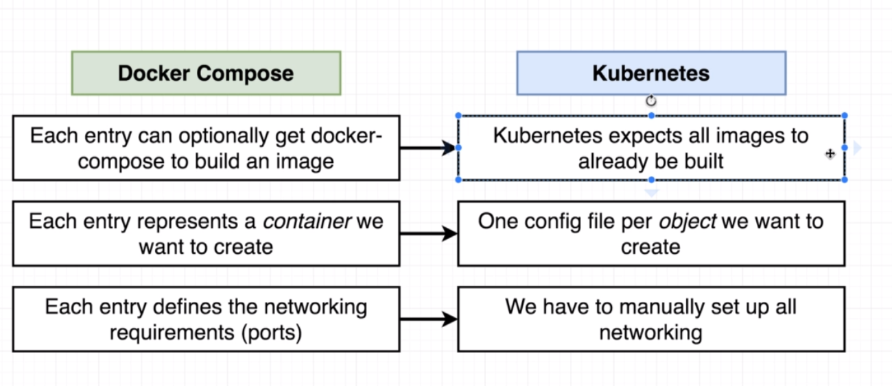
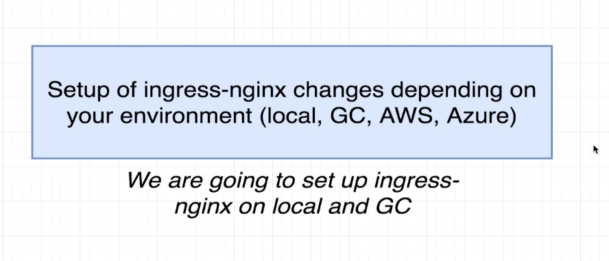
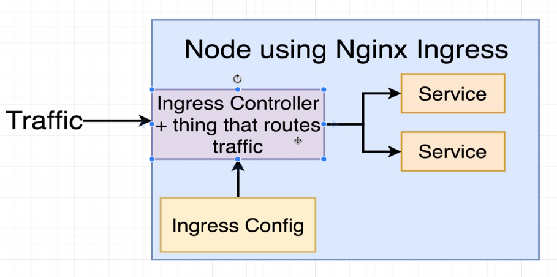

# Docker and Kubernetes the Complete Guide

* **IMPORTANT**: I am taking brief notes from section 1 to 6. For a complete docker tutorial click [here](https://github.com/danielmapar/DockerTutorial)

## Section 1 to 6

 

## **Section 7**: Continuos Integration and Deployment with AWS

* `docker attach ${containerId}`: This attaches the stdin, stout and sterr from the container to the host machine

## Multi-Step Docker Builds

 

Example: 

```docker
FROM node:alpine as builder
WORKDIR '/app'
COPY package.json .
RUN npm install
COPY . .
RUN npm run build

FROM nginx
COPY --from=builder /app/build /usr/share/nginx/html
```
* Running a single container using Elastic Beanstalk
  * Create an environment (Web server environment)
  * Select `Docker` as a platform 
  *  

## **Section 8**: Building Multi-Container Application

* Setting up NGINX as a reverse proxy to access 2 different services
  *  

## **Section 12**: Onwards to Kubernetes

* Kubernetes are similar to docker swarm, and we will use it to deploy a service in multiple containers

    * 

* To run it locally we will use a software called `minikube`, but their are a vast universe of production environments that can be used: `Amazon Elastic Container Service for Kubernetes (EKS)`, `Google Cloud Kubernetes Engine (GKE)` or Do it your self
    * 

* `kubectl`: Program for managing containers in the node (command line tool)
* `minikube`: Use for managing the VM itself. Create and run a Kubernetes cluster in your local machine

    * 

*  

* To install `kubectl` and `minikube` check this [link](https://medium.com/@JockDaRock/minikube-on-windows-10-with-hyper-v-6ef0f4dc158c)
    * For Windows give preference to the Chocolatey package manager approach

* First command `minikube start`
    * For windows using Hyper-V you should run something like: `minikube start --vm-driver hyperv --hyperv-virtual-switch "Primary Virtual Switch"`
    * `minikube stop`
        * `minikube ssh | sudo poweroff`

* To check cluster status run: 
    * `minikube status`
    * `kubectl cluster-info`

* For a visual cluster dashboard run: `minikube dashboard`

*   

*  

* `k8s` = kubernetes (abbreviation)

* For any type of resource we need to create a file in Kubernetes (Objects).

    *  
    * `Pod`: Run a container 
    * `Service`: Setup some kind of networking in a Kubernetes cluster
    *  

* A virtual machine is a `Node`
    * `Pod` is a grouping of containers (1 or more) with a very common purpose   
        * Container that are tightly coupled 
        * 


* 

*  
    * Every single Node (VM) has a `kube-proxy` to enable communication to the outside world

* ```yml
    apiVersion: v1
    kind: Service
    metadata:
    name: client-node-port
    spec:
    type: NodePort
    ports:
        - port: 3050
        targetPort: 3000
        nodePort: 31515
    selector:
        component: web
    ```
    * The `port` option is for another `Pod` to access our `Pod`.
    * The `nodePort` is the actual port we will use to access the `Pod` from our host machine.

* 

* In order to start our Kubernetes cluster, we will find those new configuration files by doing:
    * `kubectl apply -f <filename>`
      * `apply` will change the current configuration of our cluster
      * `kubectl get pods`: Get information of all running pods
      * `kubectl get services`: Get information of all service objects created. An example is the `NodePort` service that forwards pods traffic
        * `client-node-port   NodePort    10.96.81.127   <none>        3050:31515/TCP   1m`
        * `3050` is the port that other `Pods` can use to access this `Pod`
        * `31515` is the port that we will access in our host machine to reach the `Pod`
    * To access the Pods we first need to get the Node/VM` ip address
        * `minikube ip`
        * `kubectl delete pods --all`
        * `kubectl delete services --all`

* 
    * `kube-apiserver` is a sort of manager that will get a `Deployment` object.
        * This object will require new pods and replicas to be created
        * `kube-apiserver` will communicate with its `Nodes` in order to deploy those pods
        * The master will always keep the correct number of containers / pods (watching the nodes)

* 

* 

    * **Imperative Deployments**: basically you will feed the masters with config files by hand. Example: `kubectl apply -f node.yml` and `kubectl apply -f node-port.yml`
    * **Declarative Deployment**: We will feed master with a single config file that will describe our container setup


* 

## **Section 13**: Maintaining Sets of Containers with Deployments 

* 
    * The Deployment script will detect and update resources based on its name, kind and image. An example is the `client-pod`, we will update it by referencing its name
    * `kubectl get deployment`
        * `kubectl delete deployment ${name}`

* To update a `Pod` using an imperative approach we do:
    * `kubectl apply -f .\client-pod-updatepod.yml`

* To get detailed information about an object we will run the following command:
    * 
    * `kubectl describe pods client-pod`

* Whenever we try to update a `Pod` manually, we are only able to update its image, but not its port

* 
    * 
    * With a `Deployment` we can change any type of configuration related to `Pods`. That will enable us to change the port number and other properties that we could not do by using `kubectl apply`

* To delete a running object you could do:
    *  

* After that we will create a `Deployment` object by doing:
    * `kubectl apply -f .\client-deployment.yaml`
    * `kubectl get deployments`
        * The `desired` column represents the number of replicas we want this pods to have (replicas)
        * `up-to-date` is related to changes on the `Deployment` file that still need to reflect at some pods

* The command `kubectl get pods -o wise` will give more information about our pods and its relation with the Node (the vm)

* It is important to point out that the existence of a `Service` is crucial. Since our pods will be constantly updated, their ips inside the Node will change. On that note, having a `Service` using a selector to find its `Pods` helps us by creating a solid association to those containers, that way we can keep using the same `minikube ip` address

*  
    *  
    * By doing `kubectl set image deployment/client-deployment client=stephengrider/multi-client:v5` we are able to update the container image inside the pods that were deployed using the `Deployment` config.

* In order to see the cointainers running inside your node, you could do `minikube ssh` and `docker ps` or you can reconfigure your local docker-cli to point to your minikube VM.
    * To do that you will run `eval $(minikube docker-env)`
    * For Windows: `& minikube docker-env | Invoke-Expression`
        * The advantages of accessing your containers inside the VM directly is the possibility to:
            * Run: `docker ${containerName} logs`
            * Run: `docker exec -it ${containerName} sh`

 * You can also run commands through kubectl as well:
    * `kubectl get pods`
    * `kubectl logs ${podName}`
    * `kubectl exec -it ${podName} sh`

## **Section 14**: A Multi-Container App with Kubernetes

*   
* 
    * The `ClusterIP` service will enable us to connect `Pods` internally. Otherwise they will be unable to communicate.

* ```yaml
    apiVersion: v1
    kind: Service
    metadata:
    name: client-cluster-ip-service
    spec:
    type: ClusterIP
    selector:
        component: web
    ports:
        - port: 3000
        targetPort: 3000
    ```
    * `port`: internal port used inside the VM
    * `targetPort`: the port opened by the `Pod`

* You could apply all the `yaml` files at once by doing `kubectl apply -f ${folderName}`

* 

* Eventually we will end up with many `yaml` files.
    * If you want to condense everything in a single `yaml` file you just need to separate the content by doing a `---`.

* Inside the `k8s` folder you will notice a service that needs a persistent volume. That service is the `postgres` database:
    * In order to do that we will use something called PVC (Persistent Volume Claim). It is similar to mapping container volume to your host machine in a docker-compose file.

    * ```yaml
        apiVersion: apps/v1
        kind: Deployment
        metadata:
        name: postgres-deployment
        spec:
        replicas: 1
        selector:
            matchLabels:
            component: postgres
        template:
            metadata:
            labels:
                component: postgres
            spec:
            volumes:
                - name: postgres-storage
                persistentVolumeClaim:
                    claimName: database-persistent-volume-claim
            containers:
                - name: postgres
                image: postgres
                ports:
                    - containerPort: 5432
                volumeMounts:
                    - name: postgres-storage
                    mountPath: /var/lib/postgresql/data
                    subPath: postgres
                env:
                    - name: PGPASSWORD
                    valueFrom:
                        secretKeyRef:
                        name: pgpassword
                        key: PGPASSWORD
        ```

* 
    * A pure kubernetes volume is tied up to the `Pod`
        * If the `Pod` dies, the volume will be removed as well

*  

*  
    * Persistent Volume is not tied to the `Pod`

*  
    * A Persistent Volume Claim is like an advertisement. We will write a config file that lets all the `Pods` know their available options of volumes
    * Whenever a `Pod` requests the advertised volume, either Kubernetes will find that it already has it created (Statically Persistent Volume) or it will create it on the fly (Dynamically provisioned Persistent Volume)

*  

* ```yaml
    apiVersion: v1
    kind: PersistentVolumeClaim
    metadata:
        name: database-persistent-volume-claim
    spec:
    accessModes:
        - ReadWriteOnce
    resources:
        requests:
            storage: 2Gi
    ```

*  

* To find who is the provisioner of space, just run: `kubectl get storageclass`

* ```yaml
    volumes:
            - name: postgres-storage
            persistentVolumeClaim:
                claimName: database-persistent-volume-claim
    ```
    * Here we create a connection with our PVC

* ```yaml
    containers:
            - name: postgres
            image: postgres
            ports:
                - containerPort: 5432
            volumeMounts:
                - name: postgres-storage
                mountPath: /var/lib/postgresql/data
                subPath: postgres
    ```
    * Here we connect the container to our PVC by using `name: postgres-storage` 
    * We tell our PVC that we will store the content in a folder called `/var/lib/postgresql/data`. It will then create a link from this folder inside the container to the actual persistent volume 
    * We also specify a `subPath`. That is basically telling the PVC that this data from `mounthPath` needs to be saved in a folder called `postgres` in the persistent volume.

* By running `kubectl get pv` we are able to get all created persistent volumes. Also, you can run `kubectl get pvc` to get all persistent volume claims (the advertisement).

*  

    * Secret are a type of object that is made for storing secrets: `apiKey`, `ssh key`, `db pw`
    * Imperative in nature
        * `kubecrl create secret generic ${secret_name} --from-literal key=value`
        * `kubecrl create secret generic pgpassword --from-literal PGPASSWORD=123`
            * Can be `generic`, `docker-registry`, or `tls` (for https)
            * `--from-literal`: We are going to add the secret information into this command
        * `kubectl get secrets`
        * ```yaml
            env:
            - name: PGPASSWORD
              valueFrom:
                secretKeyRef:
                  name: pgpassword
                  key: PGPASSWORD
            ```

## Section 15: Handling Traffic with Ingress Controllers

* In order to enable traffic between the host machine and the Node, we will create a `Ingress` Service.

*   
    * A `LoadBalancer` only gives you access to a single set of Pods
    * It is legacy, don't use it

*   
    * We are using the `ingress-nginx` project from the Kubernetes team
    *  

*  

*  
    * The ingress service is really similar to a `Deployment` object. That means that as soon as we feed a Ingress Config to the Ingress Controller, it will find a way to create a service that can handle traffic based on our requirements. 

*  

*  
    * Google Cloud still uses the `Load Balancer` service, and it will be connected to our nginx/Deployment Pod

* nginx ingress will not contact the `Cluster Ip` Service, but it will actually communicate directly to the containers inside the Pod. The reason for that is because some apps need to maintain sessions (apache tomcat for example)
    * That is why we are not making our own `Pod` with nginx + the `Load Balancer`
    * Amazing post to understand ingress [here](https://www.joyfulbikeshedding.com/blog/2018-03-26-studying-the-kubernetes-ingress-system.html)
        * In a nutshell, the Ingress Nginx Controller basically watches for resource types: `Ingresses`, `Endpoints`, `Secrets` and `ConfigMaps`. Whenever a change is detected, the Ingress Controller triggers and update, collects information using Kubernetes API, generates a new nginx conf file with the current Pod IPs that ingress should route to. Both Ingress Controller and nginx are running in the same Pod
        * According to the Nginx ingress controller's documentation, it does not route traffic to the associated Service's virtual IP address. Instead it routes directly to the pods' IP addresses, using the endpoints API, for performance reasons and to allow features like session affinity

*  
    * `kubectl apply -f https://raw.githubusercontent.com/kubernetes/ingress-nginx/master/deploy/mandatory.yaml`
    * `minikube addons enable ingress`

* Open `ingress-service.yaml`:
    * `nginx.ingress.kubernetes.io/rewrite-target: /`
        * If the URL is `/api`, this rule will remove any thing after the `/`.
        *  