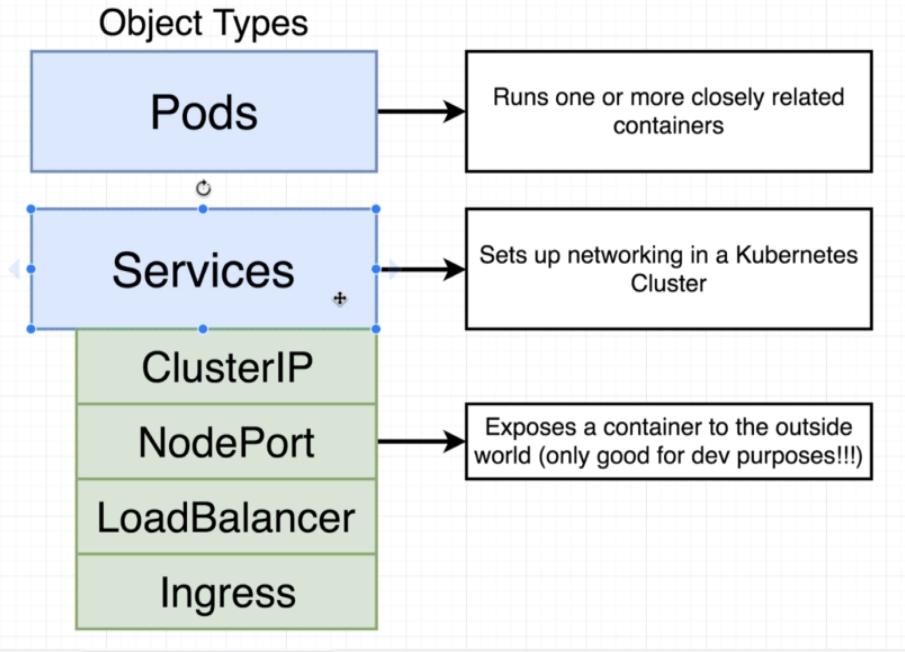

# Docker and Kubernetes the Complete Guide

* **IMPORTANT**: I am taking notes from section 7 to 17. For a complete docker tutorial click [here](https://github.com/danielmapar/DockerTutorial)

## **Section 7**: Continuos Integration and Deployment with AWS

* `docker attach ${containerId}`: This attaches the stdin, stout and sterr from the container to the host machine

## Multi-Step Docker Builds

 

Example: 

```docker
FROM node:alpine as builder
WORKDIR '/app'
COPY package.json .
RUN npm install
COPY . .
RUN npm run build

FROM nginx
COPY --from=builder /app/build /usr/share/nginx/html
```
* Running a single container using Elastic Beanstalk
  * Create an environment (Web server environment)
  * Select `Docker` as a platform 
  *  

## **Section 8**: Building Multi-Container Application

* Setting up NGINX as a reverse proxy to access 2 different services
  *  

## **Section 12**: Onwards to Kubernetes

* Kubernetes are similar to docker swarm, and we will use it to deploy a service in multiple containers

    * 

* To run it locally we will use a software called `minikube`, but their are a vast universe of production environments that can be used: `Amazon Elastic Container Service for Kubernetes (EKS)`, `Google Cloud Kubernetes Engine (GKE)` or Do it your self
    * 

* `kubectl`: Program for managing containers in the node (command line tool)
* `minikube`: Use for managing the VM itself. Create and run a Kubernetes cluster in your local machine

    * 

*  

* To install `kubectl` and `minikube` check this [link](https://medium.com/@JockDaRock/minikube-on-windows-10-with-hyper-v-6ef0f4dc158c)
    * For Windows give preference to the Chocolatey package manager approach

* First command `minikube start`
    * For windows using Hyper-V you should run something like: `minikube start --vm-driver hyperv --hyperv-virtual-switch "Primary Virtual Switch"`
    * `minikube stop`
        * `minikube ssh | sudo poweroff`

* To check cluster status run: 
    * `minikube status`
    * `kubectl cluster-info`

* For a visual cluster dashboard run: `minikube dashboard`

*   

*  

* `k8s` = kubernetes (abbreviation)

* For any type of resource we need to create a file in Kubernetes (Objects).

    *  
    * `Pod`: Run a container 
    * `Service`: Setup some kind of networking in a Kubernetes cluster
    *  

* A virtual machine is a `Node`
    * `Pod` is a grouping of containers (1 or more) with a very common purpose   
        * Container that are tightly coupled 
        * 


* 

*  
    * Every single Node (VM) has a `kube-proxy` to enable communication to the outside world

* ```yml
    apiVersion: v1
    kind: Service
    metadata:
    name: client-node-port
    spec:
    type: NodePort
    ports:
        - port: 3050
        targetPort: 3000
        nodePort: 31515
    selector:
        component: web
    ```
    * The `port` option is for another `Pod` to access our `Pod`.
    * The `nodePort` is the actual port we will use to access the `Pod` from our host machine.

* 

* In order to start our Kubernetes cluster, we will find those new configuration files by doing:
    * `kubectl apply -f <filename>`
      * `apply` will change the current configuration of our cluster
      * `kubectl get pods`: Get information of all running pods
      * `kubectl get services`: Get information of all service objects created. An example is the `NodePort` service that forwards pods traffic
        * `client-node-port   NodePort    10.96.81.127   <none>        3050:31515/TCP   1m`
        * `3050` is the port that other `Pods` can use to access this `Pod`
        * `31515` is the port that we will access in our host machine to reach the `Pod`
    * To access the Pods we first need to get the Node/VM` ip address
        * `minikube ip`
        * `kubectl delete pods --all`
        * `kubectl delete services --all`
